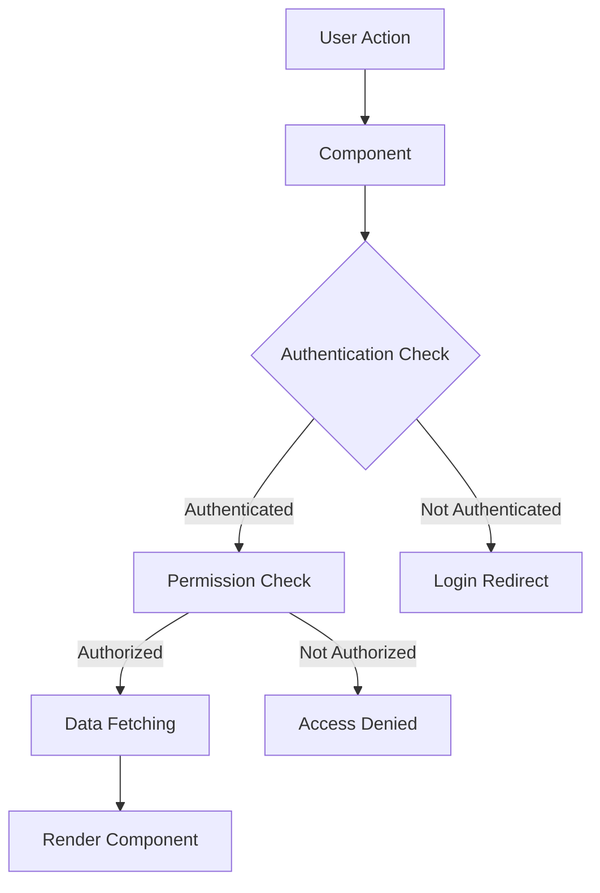
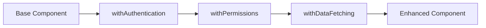
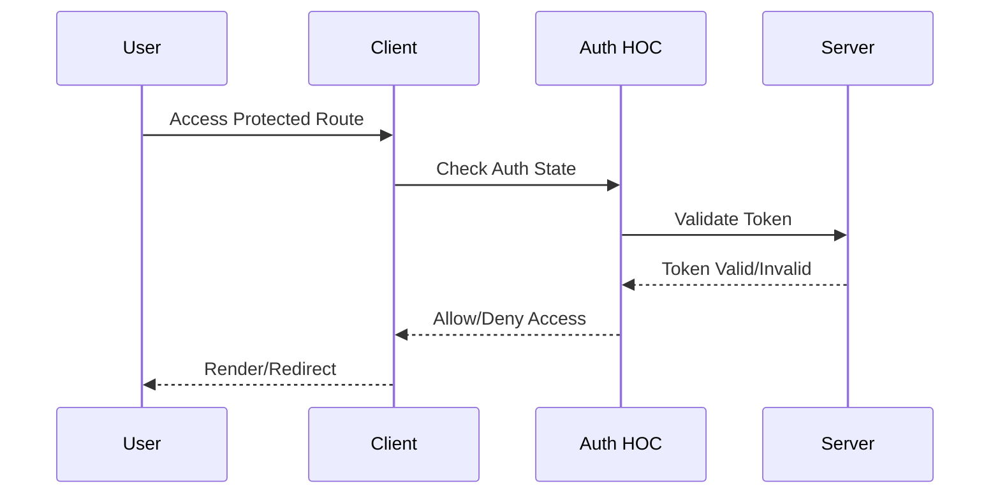
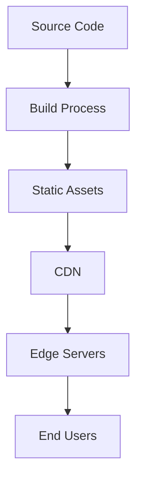

# HR Management System Architecture

## System Overview

The HR Management System is built using React and TypeScript, following a modular architecture that emphasizes component reusability, type safety, and separation of concerns.

## Core Architecture Components

### 1. Authentication Layer
```
src/
├── context/
│   └── AuthContext.tsx       # Global authentication state
└── hoc/
    └── withAuthentication.tsx # Authentication HOC
```

The authentication layer provides:
- User authentication state management
- Role-based access control
- Protected route handling
- Session management

### 2. Permission System
```
src/
└── hoc/
    └── withPermissions.tsx   # Permission management HOC
```

Features:
- Granular permission control
- Role-based feature access
- Component-level access restrictions
- Dynamic permission evaluation

### 3. Data Management
```
src/
└── hoc/
    └── withDataFetching.tsx  # Data fetching HOC
```

Capabilities:
- Centralized data fetching
- Loading state management
- Error handling
- Cache management

### 4. Component Structure
```
src/
└── components/
    ├── common/              # Shared components
    ├── employees/           # Employee-related components
    └── auth/               # Authentication components
```

## Data Flow



## State Management

### Authentication State
```typescript
interface AuthState {
  isAuthenticated: boolean;
  user: User | null;
  token: string | null;
}
```

### Permission State
```typescript
interface PermissionState {
  roles: string[];
  permissions: {
    [key: string]: boolean;
  };
}
```

## Component Enhancement Flow



## Security Architecture

### 1. Authentication Flow


### 2. Permission Checks
```typescript
const permissionCheck = {
  component: {
    beforeRender: true,
    afterDataFetch: true
  },
  data: {
    beforeFetch: true,
    afterFetch: true
  }
};
```

## Error Handling

### 1. Global Error Boundary
```typescript
class ErrorBoundary extends React.Component {
  static getDerivedStateFromError(error) {
    return { hasError: true, error };
  }
}
```

### 2. HOC Error Handling
```typescript
interface ErrorState {
  type: 'auth' | 'permission' | 'data' | 'network';
  message: string;
  code: number;
}
```

## Performance Considerations

### 1. Component Memoization
```typescript
const MemoizedComponent = React.memo(Component, (prevProps, nextProps) => {
  return prevProps.data === nextProps.data;
});
```

### 2. Data Fetching Optimization
- Caching strategies
- Request deduplication
- Lazy loading
- Pagination support

## Testing Strategy

### 1. Unit Tests
```typescript
describe('withAuthentication', () => {
  it('handles authentication state', () => {
    // Test implementation
  });
});
```

### 2. Integration Tests
```typescript
describe('Protected Route', () => {
  it('redirects unauthenticated users', () => {
    // Test implementation
  });
});
```

## Deployment Architecture



## Future Considerations

### 1. Scalability
- Component code splitting
- Dynamic imports
- Performance monitoring
- State management optimization

### 2. Maintainability
- Documentation updates
- Code style consistency
- Component library
- Automated testing

### 3. Security
- Regular security audits
- Dependency updates
- Authentication enhancements
- Permission system updates
